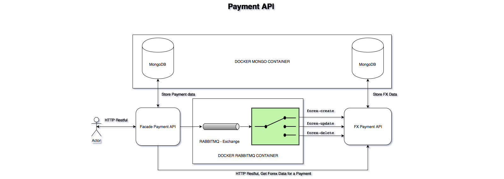
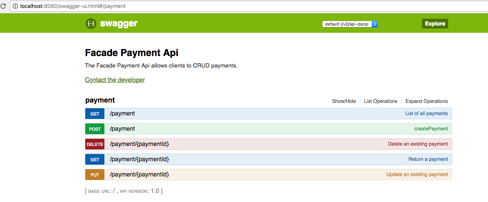
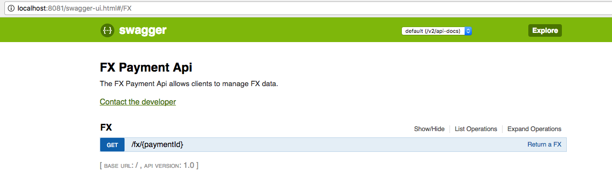

# Payment API
The Payment API is a RESTFUL API providing the following features:
- Fetch a payment resource
- Create, update and delete a payment resource
- List a collection of payment resources
- Persist resource state (e.g. to a database)

## Design
The following design is following the principles of Reactive Microservices and Domain Driven Design (DDD)
- Facade Payment API: It's a Reactive Microservice responsible to handler the communication with a HTTP Client.
It provides all the public endpoints to do CRUD. It's storing the payment data into a MongoDB. Also it's a message driven component to provide a Non-blocking communication which allows the clients to get a quicker response. For example, when creating, updating or deleting a payment this component is creating a message to communicate with other components like FX Payment API.

- FX Payment API: It's a Reactive Microservice responsible to communicate with a third party component to get the rate exchange for the payment done. Currently this is juts mocked on the implementation. Also it's storing the data in MongoDB. It provides an endpoint to return the Forex data related for a specific payment.

## Modules
This project includes the following maven modules:

- payment-facade-client: It's an auto-generated module created by Swagger following the specification from payment-facade.yaml. It's provide the HTTP Client actions in a Jar file to do CRUD operation against facade payment facade server.

- payment-facade-server: It's an auto-generated module created by Swagger following the specification from payment-facade.yaml. It provides the specification for the server implementation and the validation for the HTTP Request. Also provides an auto-generated User Interface.

- payment-facade-server-impl: It contains the code implementation for payment-facade-server. Also, it's contains unit test following TDD.

- payment-fx-client: It's an auto-generated module created by Swagger following the specification from payment-fx.yaml. It's provide the HTTP Client actions in a Jar file to do Read operation against fx payment facade server.

- payment-fx-server: It's an auto-generated module created by Swagger following the specification from payment-fx.yaml. It provides the specification for the server implementation and the validation for the HTTP Request. Also provides an auto-generated User Interface.

- payment-fx-server-impl: It contains the code implementation for payment-fx-server. Also, it's contains unit test following TDD.

- payment-integration-test: It the BDD feature files for this project.

## RESTFUL API

## Technologies
This is the technologies stack
- Java 8
- Maven
- Git
- Docker
- MongoDB
- RabbitMQ
- Spring Boot
- Swagger
- JUnit 
- Mockito
- Cucumber

## How to build and run
First it's required to run the docker containers for MongoDB and RabbitMQ:
1. from the command line: `docker-compose up -d`
2. Once the containers are running, you can build the project using `mvn clean install`. As this project includes integration test, it needs run facade server impl and facade fx server impl, so it might take few seconds before running the integration tests.
3. Finally start the two microservices:

`java -jar /payment-facade-server-impl/target/payment-facade-server-impl-0.1.0.jar`

`java -jar /payment-fx-server-impl/target/payment-fx-server-impl-0.1.0.jar`

## Links
https://www.reactivemanifesto.org/

http://domainlanguage.com/ddd/

## ToDo
- Currently the Facade Payment API storing data about the payment and others like beneficary Party, debtor Party and Sponsor Party. That could be hanlder in a different Reactive Microservice following DDD as FX Payment API.
 